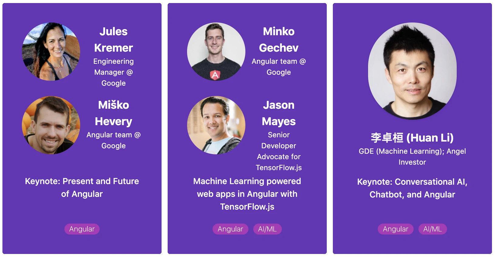

# ng2020-wechaty

Ng+ Developers Conference 2020 Keynote: Conversational AI, Chatbot, and Angular

## Ng+ Developers Conference 2020

[](https://ng-plus.dev/#/topics)

Knowledge, ideas, and insights for the Next Generation

> November 21 - 22 @online

- ngChina 2020: <https://ng-plus.dev>
- ngChina 2019: <https://ng-china.org>

## Live Coding Steps

### 1. `ng new my-app`

```sh
npx --package @angular/cli ng new my-app
cd my-app
ng serve --open
```

Branch: [ng_new_my-app](https://github.com/huan/ng2020-wechaty/tree/ng_new_my-app)

Learn more from <https://angular.io/guide/setup-local>

### 2. Wechaty

```sh
test
```

## Author

[Huan LI](https://github.com/huan) ([李卓桓](http://linkedin.com/in/zixia)), Microsoft AI MVP, zixia@zixia.net

[](https://stackexchange.com/users/265499)

## Copyright & License

- Docs released under Creative Commons
- Code released under the Apache-2.0 License
- Code & Docs © 2018 Huan LI \<zixia@zixia.net\>
