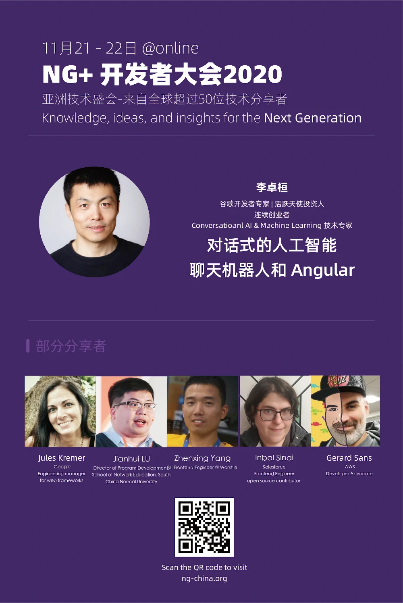

# ng-plus-wechaty

## Requirements

1. Wechaty Token

### Wechaty Token: apply a token from Wechaty Puppet Service Providers

You can apply a Windows / Pad protocol token from our puppet service providers:

1. [Apply Wechaty Puppet Service Token](https://github.com/wechaty/puppet-supports/issues/new/choose)
1. [Wechaty Puppet Service FAQ](https://wechaty.js.org/docs/puppet-services/faq)

#### Create a Wechaty Puppet Service Token by yourself (DIY)

Copy the following shell script and then paste it into the term of your server, to setup your Wechaty token:

```sh
# learn how to DIY a Wechaty Puppet Service token at http://wechaty.js.org/docs/puppet-services/diy
export WECHATY_TOKEN=insecure_wechaty_puppet_service_token_diy

# Set port for your hostie service: must be published accessible on the internet
# Wechaty IO Client use this port to publish the Puppet Service
export WECHATY_PUPPET_SERVER_PORT=48788

# learn more about Wechaty Puppet PadLocal at https://wechaty.js.org/docs/puppet-services/padlocal
export WECHATY_PUPPET=wechaty-puppet-padlocal
# get a 7 days free token at PadLocal official website: http://pad-local.com/
export WECHATY_PUPPET_PADLOCAL_TOKEN=YOUR_PADLOCAL_TOKEN_AT_HERE

export WECHATY_LOG=verbose

docker run \
  --rm \
  -ti \
  -e WECHATY_LOG \
  -e WECHATY_PUPPET \
  -e WECHATY_PUPPET_PADLOCAL_TOKEN \
  -e WECHATY_PUPPET_SERVER_PORT \
  -e WECHATY_TOKEN \
  -p "$WECHATY_PUPPET_SERVER_PORT" \
  wechaty/wechaty:0.78
```

> Learn more: [Puppet Service: DIY](https://wechaty.js.org/docs/puppet-services/diy/) This guide will help you generate a Wechaty Token for connecting to the Wechaty Puppet Service.

## Live Coding Explanation

We have four steps in our live coding, they are saved in four separate branches for easy loading and testing.

### Step 1. `ng new my-app`

Branch: [ng_china_2020_step_1_ng_new_my-app](https://github.com/huan/ng2020-wechaty/tree/ng_china_2020_step_1_ng_new_my-app)

```sh
npx --package @angular/cli ng new my-app
cd my-app
ng serve --open
```

Learn more from <https://angular.io/guide/setup-local>

### Step 2. Wechaty

Branch: [ng_china_2020_step_2_wechaty](https://github.com/huan/ng2020-wechaty/tree/ng_china_2020_step_2_wechaty)

```sh
npm i @chatie/angular brolog
```

#### `app.module.ts`

```ts
import { WechatyModule } from '@chatie/angular'
@NgModule({
  imports: [
    WechatyModule,
    ...
  ],
  ...
```

#### `app.component.html`

```html
<wechaty
  #wechaty
  token="insecure_wechaty_puppet_service_token_diy"

  (heartbeat) = "onHeartbeat($event)"
  (scan)      = "onScan($event)"
  (login)     = "wechaty.startSyncMessage(); onLogin($event)"
  (message)   = "onMessage($event)"
>
</wechaty>
```

### Step 3. TensorFlow.js Toxicity

Branch: [ng_china_2020_step_3_toxicity](https://github.com/huan/ng2020-wechaty/tree/ng_china_2020_step_3_toxicity)

```sh
npm install @tensorflow/tfjs
npm install @tensorflow-models/toxicity

ng generate service toxicity
```

[](https://storage.googleapis.com/tfjs-models/demos/toxicity/index.html)

Learn more:

1. [TensorFlow.js models: toxicity classifier source](https://github.com/tensorflow/tfjs-models/tree/master/toxicity)
1. [TensorFlow.js toxicity classifier demo](https://storage.googleapis.com/tfjs-models/demos/toxicity/index.html): This is a demo of the TensorFlow.js toxicity model, which classifies text according to whether it exhibits offensive attributes (i.e. profanity, sexual explicitness).
1. [Text classification using TensorFlow.js: An example of detecting offensive language in browser](https://medium.com/tensorflow/text-classification-using-tensorflow-js-an-example-of-detecting-offensive-language-in-browser-e2b94e3565ce)

The traffic light code is copy/pasted from this great tutorial: [Stop in the Name of the Traffic Light](https://medium.com/@robhitt/stop-in-the-name-of-the-traffic-light-c5f4d8a9d2e6)

### 4. TensorFlow.js QnA

To be written.

Branch: [step_4_tensorflow-models_qna](https://github.com/huan/ng2020-wechaty/tree/step_4_tensorflow-models_qna)

```sh
npm install @tensorflow-models/qna
```

```ts
// to be written
```

Learn more:

1. [TensorFlow.js models: Question and Answer source](https://github.com/tensorflow/tfjs-models/tree/master/qna) Use a pre-trained model to answer questions based on the content of a given passage.
1. [TensorFlow.js models: Question and Answer demo](https://storage.googleapis.com/tfjs-models/demos/mobilebert-qna/index.html)
1. [TensorFlow Blog: Exploring helpful uses for BERT in your browser with Tensorflow.js](https://blog.tensorflow.org/2020/03/exploring-helpful-uses-for-bert-in-your-browser-tensorflow-js.html)

## Talks

### 1. Ng+ Developers Conference 2020 Keynote: Conversational AI, Chatbot, and Angular, Huan, Nov 21, 2020

[](https://ng-plus.dev/#/topics)

> November 21 - 22 @online

Knowledge, ideas, and insights for the Next Generation

- ngChina 2020: <https://ng-plus.dev>
- ngChina 2019: <https://ng-china.org>

#### Slides & Video

[](https://docs.google.com/presentation/d/1Gd3D8bS6OifXDsdSe0x5i6XsP_uISX3W9tR8yBA0mYs/edit?usp=sharing)

> Google Slides <https://docs.google.com/presentation/d/1Gd3D8bS6OifXDsdSe0x5i6XsP_uISX3W9tR8yBA0mYs/edit?usp=sharing>

Talk Video: <https://youtu.be/SACugbTNQnc>

## Resources

1. [TensorFlow.js Tutorials](https://www.tensorflow.org/js/tutorials)
1. [TensorFlow.js Models](https://www.tensorflow.org/js/models)
1. [TensorFlow.js Demos](https://www.tensorflow.org/js/demos)
1. [TensorFlow.js Examples](https://github.com/tensorflow/tfjs-examples/)
1. [TensorFlow.js Gallery](https://github.com/tensorflow/tfjs/blob/master/GALLERY.md)

## Author

[Huan LI](https://github.com/huan) ([李卓桓](http://linkedin.com/in/zixia)), Google Machine Learning Developer Expert, zixia@zixia.net

[](https://stackexchange.com/users/265499)

## Copyright & License

- Docs released under Creative Commons
- Code released under the Apache-2.0 License
- Code & Docs © 2020-2021 Huan LI \<zixia@zixia.net\>
